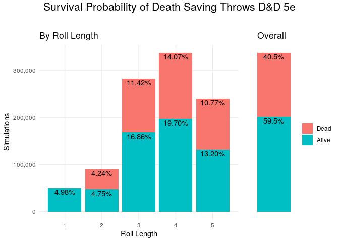

Probability of Surviving Death Saves in D\&D 5e
================
Tyler Hill
10/21/2020

## Introduction

[Dungeons and
Dragons](https://en.wikipedia.org/wiki/Dungeons_%26_Dragons) (D\&D) is a
roleplaying game originally developed in 1974 by Gary Gygax and Dave
Arneson. Players assume the role of a player character, PC, that lives
in a fantasy world and cooperate together to tackle the narrative
challenges that the Dungeon Master concocts for them. This could involve
negotiating a high stakes peace deal between warring kingdoms, defeating
a ragtag group of goblins in combat, or anything in between. There are
several iterations of the rules for how to play D\&D but we will be
looking at the Fifth Edition here, commonly referred to as 5e.

## What is a death saving throw?

PC’s have a certain amount of health. When they take damage their health
total drops. When this health total drops below zero they then have to
make death saving throws to see if their character ultimately stabilizes
and lives or dies forever.

These saving throws are done by rolling a 20 sided die, d20, and noting
the outcome in a “Successess” or “Failures” box (see Fig 1. below). If
the roll is between 2 and 9 then they get one step closer to death. If
the roll is between 10 and 19 then they get one step closer to
stabilizing. What about a roll of a 1 or 20? These numbers are special
in D\&D and are usually treated as an automatic failure or success when
trying to accomplish something. In the context of death saving throws,
rolling a 1 counts as two steps closer to death and rolling a 20 results
in your character immediately coming back to life.

Regardless, once three (or more) marks in either “Failures” or
“Successess” is reached your character either lives or dies
respectively.


## What is the likelihood of living or dying?

So, as we can see from the rules above it is not a simple probability
calculation to come up with our likelihood of either living or dying. In
order to answer this I will implement a Monte Carlo simulation to
perform thousands of death saving throw events and arrive at the
approximate answer.

First we will need a function that will perform a single death saving
throw event, that is roll a d20 enough times to determine whether or not
the PC survives.

``` r
death_save <- function() {
  # Variables to track
  live <- 0
  die <- 0
  roll_length <- 0
  
  rolling <- T
  while (rolling == T) {
    # Roll the die, increment roll_length, and increment live or die accordingly
    roll <- sample(1:20, 1)
    roll_length <- roll_length + 1
    if (roll == 20) {
      live <- live + 3
    } else if (roll == 1) {
      die <- die + 2
    } else if (1 < roll & roll < 10) {
      die <- die + 1
    } else {
      live <- live + 1
    }
    
    # Check how many successes or failures there are and either keep rolling or not
    if (live >= 3) {
      rolling <- F
      result <- 1
    } else if (die >= 3) {
      rolling <- F
      result <- 0
    }
  }
  
  # Return both the result and how many rolls it took to get that result in a list
  return(list(result, roll_length))
}
```

Next we will perform the Monte Carlo simulation by conducting 10,000 of
these death saving throw events and tracking their results.

``` r
options(digits = 2) # Report to 2 significant figures

# Conduct the Monte Carlo simulation
trials <- 10^5

ds_data <- replicate(trials, death_save())
ds_result <- unlist(ds_data[1,])
ds_roll_length <- unlist(ds_data[2,])

# Results
(mean_outcome <- mean(ds_result)) # Probability of surviving
```

    ## [1] 0.6

``` r
(mean_roll <- mean(ds_roll_length)) # The average number or rolls in a death saving throw event
```

    ## [1] 3.6

So, it looks like we have a roughly 60% chance of surviving a death
saving throw event and an average death saving throw event takes between
3 and 4 rolls to determine.

## Survival probability broken down by roll length

We can dig deeper into the results and graphically show the probability
of survival not only overall but broken down by roll length.

``` r
# Plot the results
library(ggplot2)
library(scales)
library(gridExtra)
df <- data.frame(rolls=ds_roll_length, results=ds_result, d_a=rep("", trials))

p <- ggplot(df, aes(d_a, fill=factor(results))) + 
  geom_bar() +
  geom_text(aes(label=scales::percent(..count../sum(..count..))), stat='count', position="stack", vjust=1.2) +
  theme(legend.position = "none") + labs(title = "Overall", x="Outcome", y="Simulations")

p2 <- ggplot(df, aes(rolls, fill=factor(results))) + geom_bar()  + 
  labs(title = paste("By Roll Length (",format(trials, scientific = T), " simulations)", sep=""), 
       x="Roll Length", y="") +
  theme(legend.title = element_blank()) + 
  scale_fill_discrete(labels=c("Dead", "Alive")) +
  geom_text(aes(label=scales::percent(..count../sum(..count..))), stat='count', position="stack", vjust=1.2) 

grid.arrange(p, p2, widths=c(1,3))
```

<!-- -->

From the graph above we can see that you are most likely to roll more
than 2 times before you either succeed or fail. This is important
because death saving throws are usually performed while the PCs are in
combat. Combat in D\&D is turned based so this means that if a player
“goes down” and is performing death saving throws each round, then the
other PCs should immediately do their best on their turn to help that
player (ie. heal or stabilize them with a medicine check) before their
third death saving throw.
